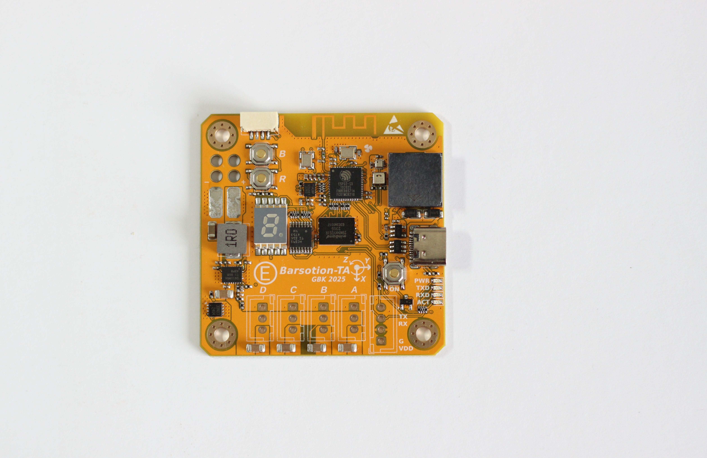
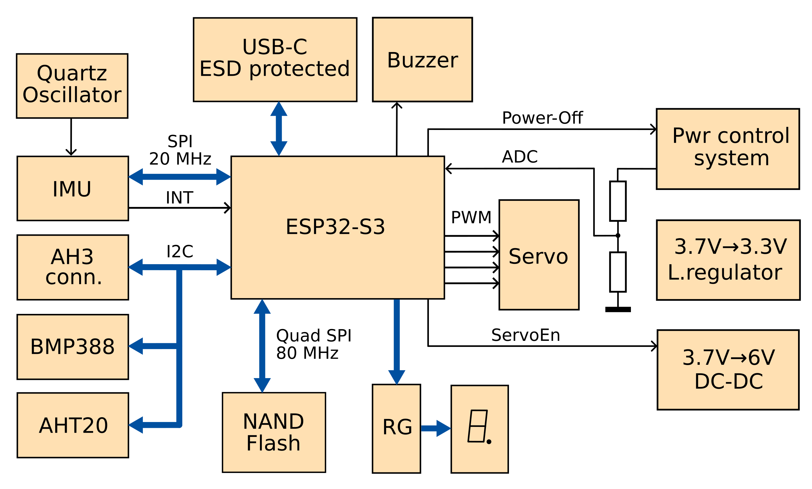

# Barsotion-TA
Board computer for model rockets, the 11th board after Berkut

## ⚡️Features
- Dual-core 240MHz Xtensa processor (in ESP32-S3)
- 512 MB log flash
- Up to 8kHz IMU cycle frequency
- Barometer, thermometer, hygrometer
- Onboard DC-DC pull-up converter for servos
- 2.4GHz Wi-Fi / Bluetooth / BLE antenna

## ⚡️Manual
- [EA&TA_user_manual_revD.pdf (newest revision)](./Manual/EA&TA_user_manual_revD.pdf)
- [EA&TA_user_manual_revC.pdf](./Manual/EA&TA_user_manual_revC.pdf)
- [EA&TA_user_manual_preliminary_edition_revB.pdf](./Manual/EA&TA_user_manual_preliminary_edition_revB.pdf)
- [EA&TA_user_manual_preliminary_edition_revA.pdf](./Manual/EA&TA_user_manual_preliminary_edition_revA.pdf)

## ⚡️Software
- [EA & TA software packet](https://github.com/Barsy-Barsevich/Barsotion-xA-software)

## ⚡️Continious progress
- [Previous board: Barsotion-EA](https://github.com/Barsy-Barsevich/Barsotion-EA)
- [Previous board: Barsotion-AH4](https://github.com/Barsy-Barsevich/Barsotion-AH4)

## ⚡️Schematic
[Full electrical schematic in .pdf](./Schematic/Barsotion-TA_Schematic_v1.6.pdf)

## ⚡️Parameters
- Microcontroller: ESP32-S3FN8 (2x Xtensa LX7 core)
- Clock frequency: 240MHz
- Gyroscope: on-board ICM-42688-P (SPI, interrupt channel)
- Barometer: on-board, BMP388 (I2C)
- Hygrometer: on-board, AHT20 (I2C)
- Memory: 4Gbit SPI NAND Flash W25N04KVZEIG (Quad SPI)
- Quartz Gyroscope's ODR frequency stabilization
- 2.4GHz Wi-Fi / Bluetooth / BLE antenna
